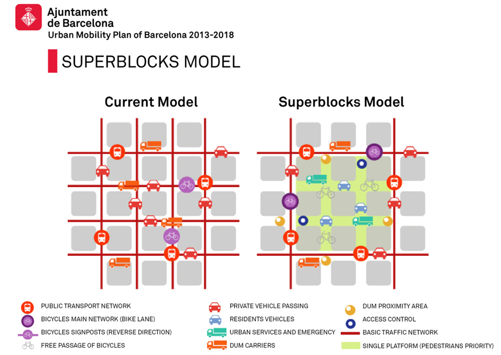
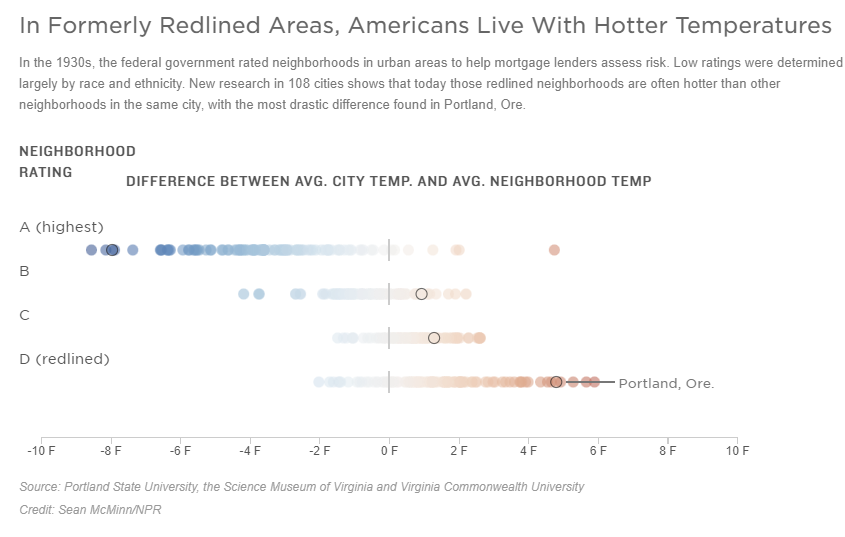
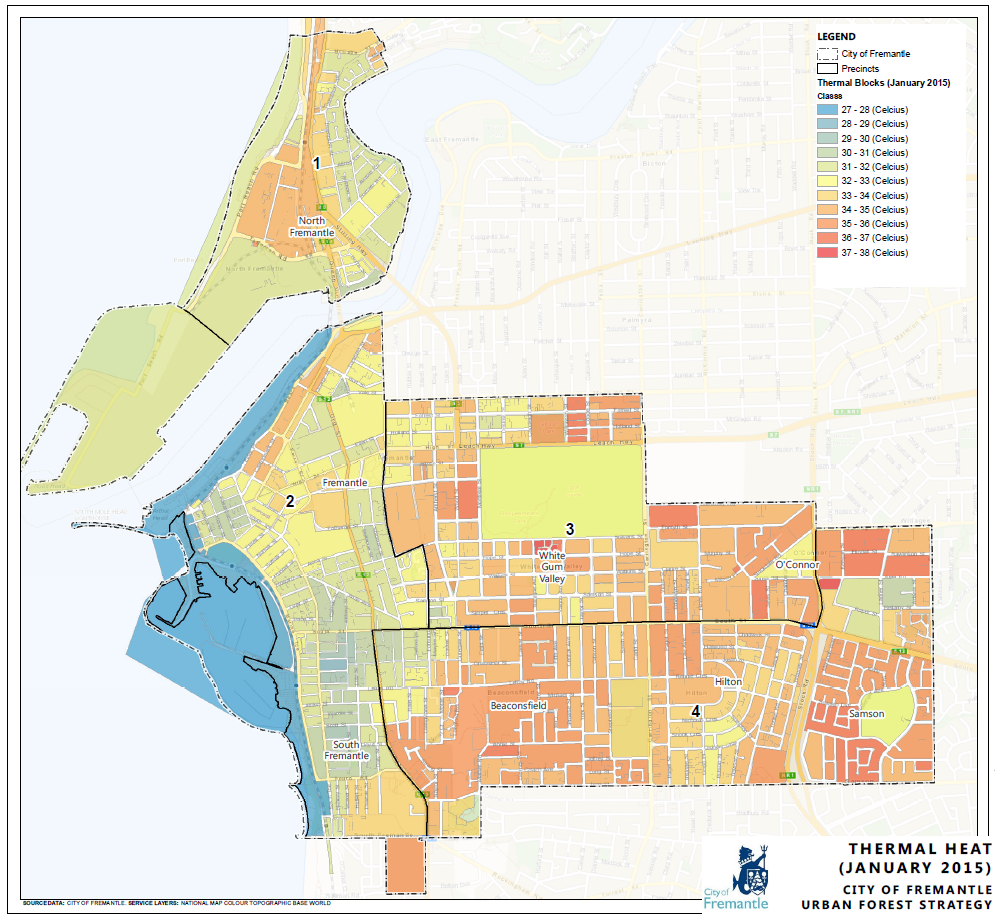

```{r setup, include=FALSE}
options(htmltools.dir.version = FALSE)
```

```{r xaringan-all, echo=FALSE}
library(countdown)
library(xaringan)
library(xaringanExtra)
library(knitr)

hook_source <- knitr::knit_hooks$get('source')
knitr::knit_hooks$set(source = function(x, options) {
  x <- stringr::str_replace(x, "^[[:blank:]]?([^*].+?)[[:blank:]]*#<<[[:blank:]]*$", "*\\1")
  hook_source(x, options)
})

xaringanExtra::use_tachyons()
xaringanExtra::use_broadcast()
xaringanExtra::use_freezeframe()
xaringanExtra::use_scribble()
#xaringanExtra::use_slide_tone()
xaringanExtra::use_search(show_icon = TRUE, auto_search = FALSE)
xaringanExtra::use_freezeframe()
xaringanExtra::use_clipboard()
xaringanExtra::use_tile_view()
xaringanExtra::use_panelset()
xaringanExtra::use_editable(expires = 1)
xaringanExtra::use_fit_screen()
xaringanExtra::use_extra_styles(
  hover_code_line = TRUE,         
  mute_unhighlighted_code = TRUE  
)

```

class: center, title-slide, middle

background-image: url("img/CASA_Logo_no_text_trans_17.png")
background-size: cover
background-position: center


<style>
.title-slide .remark-slide-number {
  display: none;
}
</style>


```{r load_packages, message=FALSE, warning=FALSE, include=FALSE}
library(fontawesome)
```

# Remotely Sensing Cities and Environments

### Lecture 7: Temperature and policy 

### 02/02/2022 (updated: `r format(Sys.time(), "%d/%m/%Y")`)

`r fa("paper-plane", fill = "#562457")`[a.maclachlan@ucl.ac.uk](mailto:a.maclachlan@ucl.ac.uk)
`r fa("twitter", fill = "#562457")`[andymaclachlan](https://twitter.com/andymaclachlan)
`r fa("github", fill = "#562457")`[andrewmaclachlan](https://github.com/andrewmaclachlan)
`r fa("location-dot", fill = "#562457")`[Centre for Advanced Spatial Analysis, UCL](https://www.ucl.ac.uk/bartlett/casa/)

<a href="https://github.com/andrewmaclachlan" class="github-corner" aria-label="View source on GitHub"><svg width="80" height="80" viewBox="0 0 250 250" style="fill:#fff; color:#151513; position: absolute; top: 0; border: 0; left: 0; transform: scale(-1, 1);" aria-hidden="true"><path d="M0,0 L115,115 L130,115 L142,142 L250,250 L250,0 Z"></path><path d="M128.3,109.0 C113.8,99.7 119.0,89.6 119.0,89.6 C122.0,82.7 120.5,78.6 120.5,78.6 C119.2,72.0 123.4,76.3 123.4,76.3 C127.3,80.9 125.5,87.3 125.5,87.3 C122.9,97.6 130.6,101.9 134.4,103.2" fill="currentColor" style="transform-origin: 130px 106px;" class="octo-arm"></path><path d="M115.0,115.0 C114.9,115.1 118.7,116.5 119.8,115.4 L133.7,101.6 C136.9,99.2 139.9,98.4 142.2,98.6 C133.8,88.0 127.5,74.4 143.8,58.0 C148.5,53.4 154.0,51.2 159.7,51.0 C160.3,49.4 163.2,43.6 171.4,40.1 C171.4,40.1 176.1,42.5 178.8,56.2 C183.1,58.6 187.2,61.8 190.9,65.4 C194.5,69.0 197.7,73.2 200.1,77.6 C213.8,80.2 216.3,84.9 216.3,84.9 C212.7,93.1 206.9,96.0 205.4,96.6 C205.1,102.4 203.0,107.8 198.3,112.5 C181.9,128.9 168.3,122.5 157.7,114.1 C157.9,116.9 156.7,120.9 152.7,124.9 L141.0,136.5 C139.8,137.7 141.6,141.9 141.8,141.8 Z" fill="currentColor" class="octo-body"></path></svg></a><style>.github-corner:hover .octo-arm{animation:octocat-wave 560ms ease-in-out}@keyframes octocat-wave{0%,100%{transform:rotate(0)}20%,60%{transform:rotate(-25deg)}40%,80%{transform:rotate(10deg)}}@media (max-width:500px){.github-corner:hover .octo-arm{animation:none}.github-corner .octo-arm{animation:octocat-wave 560ms ease-in-out}}</style>

---

```{r, echo=FALSE}
xaringanExtra::use_progress_bar(color = "#0051BA", location = "bottom")
```

# How to use the lectures


- Slides are made with [xaringan](https://slides.yihui.org/xaringan/#1)

- `r fa("magnifying-glass")` In the bottom left there is a search tool which will search all content of presentation

- Control + F will also search 

- Press enter to move to the next result 

- `r fa("pencil")` In the top right let's you draw on the slides, although these aren't saved.

- Pressing the letter `o` (for overview) will allow you to see an overview of the whole presentation and go to a slide

- Alternatively just typing the slide number e.g. 10 on the website will take you to that slide

- Pressing alt+F will fit the slide to the screen, this is useful if you have resized the window and have another open - side by side. 

```{r xaringan-logo, echo=FALSE}
xaringanExtra::use_logo(
  image_url = "img/casa_logo.jpg"
)
```
---
# Lecture outline

.pull-left[

### Part 1: Temperature and policy


### Part 2: Extracting temperature from satellite data

]

.pull-right[
```{r echo=FALSE, out.width='100%'}
knitr::include_graphics('img/satellite.png')
```
.small[Source:[Original from the British Library. Digitally enhanced by rawpixel.](https://www.rawpixel.com/image/571789/solar-generator-vintage-style)
]]

---
class: inverse, center, middle

# Let's recall some policy we looked at...with a focus on the Urban Heat Island (or temperature)


---

class: inverse, center, middle

# What is the Urban Heat Island 

## What is the problem?

---

#  What is the Urban Heat Island 

>  urban areas obtain comparatively higher atmospheric and surface temperatures than surrounding rural areas

```{r echo=FALSE, out.width='55%', fig.align='center'}

```
.small[Source:[EARTH.ORG](https://earth.org/data_visualization/urban-heat-islands/)
]

---
class: inverse, center, middle


#  What is the Urban Heat Island 2


<iframe width="560" height="315" src="https://www.youtube.com/embed/Y-bVwPRy_no" title="YouTube video player" frameborder="0" allow="accelerometer; autoplay; clipboard-write; encrypted-media; gyroscope; picture-in-picture" allowfullscreen></iframe>

---

#  What is the Urban Heat Island 3

.pull-left[

**Two main** factors:

1. More dark surfaces that retain heat
1. Less vegetation that cools the environment (evapotranspiration and solar blocking)

But other factors include:

* A low Sky View Factor (SVF)
  * radiation received (or emitted) by a planar surface to the radiation emitted (or received) by the entire hemispheric environment
* air speed, cloud cover, cyclic solar radiation, building material type and anthropogenic energy

]

.pull-right[

```{r echo=FALSE, out.width='100%', fig.align='center'}
knitr::include_graphics('img/UHI_contributors.png')
```
.small[Fig 1: Factors responsible for Urban Heat Island Effect. (Source – Osmond, 2017) Source here:[Cidco Smartcity](https://niua.org/cidco/urban-heat-island-effect-causes-and-remedies/)
]
]

---
# How much does it cost

.pull-left[

**Social**

* Population adjusted excess mortality rates during the 1998
Shanghai heatwave were estimated at **27.3 per 100,000 within the urban area** compared to only **7
per 100,000 in the exurban** districts [Tan et al. 2009](https://link.springer.com/article/10.1007/s00484-009-0256-x#:~:text=An%20examination%20of%20summer%20mortality,exposure%20to%20extreme%20thermal%20conditions.)

**Environmental**

* Each degree of ambient temperature rise the increase in peak
electricity load has been estimated between 0.45 and 4.6%, corresponding to around 21 W per
degree rise per person [Santamouris et al. 2015](https://www.sciencedirect.com/science/article/pii/S0378778814007907)
* Fossil fuel + pollution
]

.pull-right[

```{r echo=FALSE, out.width='100%', fig.align='center'}

```
.small[Buffalo - August 3, 2002. Source:[Earth Observatory, NASA](https://earthobservatory.nasa.gov/images/47704/urban-heat-islands?src=ve)
]

```{r echo=FALSE, out.width='100%', fig.align='center'}
knitr::include_graphics('img/providence_etm_2002212.jpg')
```
.small[Providence - July 31, 2002. Source:[Earth Observatory, NASA](https://earthobservatory.nasa.gov/images/47704/urban-heat-islands?src=ve)
]

]

???

* Increase in fossil fuel usage 
* Energy use from extra demand 
* Heat related deaths 
* Cardiac and respiratory

---


# How much does it cost 2

**Economic**

.panelset[

.panel[.panel-name[Local]


.pull-left[
* Melbourne first assessment $300 million (AUD) of which health $282. Other factors:
  * transport
  * energy
  * anti-social behavior
  * [AECOM, 2012](https://www.melbourne.vic.gov.au/sitecollectiondocuments/eco-assessment-of-urban-heat-island-effect.pdf)
]

.pull-right[
```{r echo=FALSE, out.width='100%', fig.align='center'}

```
.small[Source:[AECOM, 2012](https://www.melbourne.vic.gov.au/sitecollectiondocuments/eco-assessment-of-urban-heat-island-effect.pdf)
]
]
]


.panel[.panel-name[GDP]

Gross Domestic Product (GDP) = value of finished goods and services within a country 


.pull-left[
Percent GDP lost from UHI

* Under low Green House Gas scenario
  * 0.71% (in 2050) and 1.04% (in 2100)

* Under very high Green House Gas scenario
  * 0.80% (in 2050) and 1.79% (in 2100)

.small[Source:[Estrada et al. 2017](https://www.nature.com/articles/nclimate3301.pdf)
]
]

.pull-right[


* UHI excluded from Global Climate Change (GCC) scenarios


]
]

]

---

# Hope

```{r echo=FALSE, out.width='50%', fig.align='center'}
knitr::include_graphics('img/mitigation_urbanimpacts.png')
```
.small[Source:[Estrada et al. 2017](https://www.nature.com/articles/nclimate3301.pdf)
]


---

# Context

.pull-left[
Representative Concentration Pathway (RCP):

* 4.5
  *  intermediate scenario
  * Co2 declines around 2045

* 6
  * peak emission 2080 then decline 

* 8
  * Continued emission rise = worst case scenario
]


.pull-right[

```{r echo=FALSE, out.width='100%', fig.align='center'}
knitr::include_graphics('img/RCP.png')
```
.small[Source:[Wikipedia](https://en.wikipedia.org/wiki/Representative_Concentration_Pathway#/media/File:All_forcing_agents_CO2_equivalent_concentration.svg)
]

* Note, in 2017 the RCPs were updated with the Shared Socioeconomic Pathways (SSPs) 

* See the [carbonbrief explainer](https://www.carbonbrief.org/explainer-the-high-emissions-rcp8-5-global-warming-scenario/)

]

---

class: inverse, center, middle

# Is policy helping us?


---

class: inverse, center, middle

# Global

---
# Global policy documents

* New Urban Agenda = standards and principles for planning, construction, development, management and urban improvement


.panelset[

.panel[.panel-name[point 54]

> We commit ourselves to the generation and use of renewable and affordable energy and sustainable and efficient transport infrastructure and services, where possible, 

> achieving the **benefits of connectivity and reducing the financial, environmental and public health costs of inefficient mobility, congestion, air pollution, urban heat island effects and noise**. 

> We also commit ourselves to giving particular attention to the energy and transport needs of all people, particularly the poor and those living in informal settlements. We also note that reductions in renewable energy costs give cities and human settlements an effective tool to lower energy supply costs. 


]
.panel[.panel-name[point 79]

> We commit ourselves to promoting international, national, subnational and local climate action, including climate change adaptation and mitigation, 

> **and to supporting the efforts of cities and human settlements, their inhabitants and all local stakeholders as important implementers**.

]

.panel[.panel-name[point 37]

> We commit ourselves to promoting **safe, inclusive, accessible, green and quality public spaces, including streets, sidewalks and cycling lanes, squares, waterfront areas, gardens and parks**, 

> that are multifunctional areas for social interaction and inclusion, **human health and well-being**
  
]
]


---

# Global policy documents


* Sustainable Development Goals (SDG) = targets with measurable indicators for monitoring

.panelset[

.panel[.panel-name[Goal 11]

* Goal 11: Make cities and human settlements inclusive, safe, resilient and sustainable


]
.panel[.panel-name[Target]

* No direct mention of urban heat in [the targets](https://unstats.un.org/sdgs/metadata/?Text=&Goal=11&Target=)...but...

  * [2018 SDG 11 issue brief](https://wedocs.unep.org/handle/20.500.11822/25763)
  
> Investing in parks and green spaces in urban areas will help to amelioratethe urban heat island effect and improve air quality in urban spaces.

> We work with national coordination units that support integrated urban planning and mapping and promote sustainable heating and cooling in related and cross-sector policy frameworks at multiple levels


.panel[.panel-name[COP26]

Following 2021 United Nations Climate Change Conference in Glasgow....[beat the heat handbook](https://www.unep.org/resources/report/beating-heat-sustainable-cooling-handbook-cities)

.center[
<iframe width="560" height="315" src="https://www.youtube.com/embed/OqMpbL1dnX0" title="YouTube video player" frameborder="0" allow="accelerometer; autoplay; clipboard-write; encrypted-media; gyroscope; picture-in-picture" allowfullscreen></iframe>
]]
]
]

---

# Beat The Heat Handbook

* This handbook contains a **lot** of information and it's easy to get lost

.pull-left[

* Would a city planner engage with all **208 pages?**

* If is the first full guide on UHI that suggests
  * Baseline assessment 
  * Key factors to consider(p. 60) such as albedo, urban form, city zoning, green cover, heat maps (that mention satellite data) - **Chapter 5**
  
* First major document that calls for specific integration into policy

]


.pull-right[

```{r echo=FALSE, out.width='100%', fig.align='center'}

```
.small[Source:[Beating the Heat: A Sustainable Cooling Handbook for Cities](https://www.unep.org/resources/report/beating-heat-sustainable-cooling-handbook-cities)
]

]  
  

---
# Beat The Heat Handbook 2

```{r echo=FALSE, out.width='65%', fig.align='center'}
knitr::include_graphics('img/matrix_to_support.png')
```
.small[Source:[Beating the Heat: A Sustainable Cooling Handbook for Cities](https://www.unep.org/resources/report/beating-heat-sustainable-cooling-handbook-cities)
]

---

# Beat The Heat Handbook 3

```{r echo=FALSE, out.width='50%', fig.align='center'}

```
.small[Source:[Beating the Heat: A Sustainable Cooling Handbook for Cities](https://www.unep.org/resources/report/beating-heat-sustainable-cooling-handbook-cities)
]

---
class: inverse, center, middle

# Local

### As the Beat The Heat Handbook contains examples of local policy we will start here first then more to metropolitan policy 

---
# Beat the Heat Handbook...

...Has many examples of mitigation...**although some aren't in response to the UHI**...they were in place before / an associated benefit is temperature reduction 


```{r echo=FALSE, out.width='80%', fig.align='center'}
  
```
.small[Source:[Beating the Heat: A Sustainable Cooling Handbook for Cities](https://www.unep.org/resources/report/beating-heat-sustainable-cooling-handbook-cities)
]

---
# Beat the Heat Handbook...

```{r echo=FALSE, out.width='80%', fig.align='center'}
  
```
.small[Source:[Beating the Heat: A Sustainable Cooling Handbook for Cities. Image: regenerativedesign.world](https://regenerativedesign.world/superblocks/?utm_source=rss&utm_medium=rss&utm_campaign=superblocks)
]
---
class: center, inverse, middle

# Medellín Green Corridors 

<iframe width="560" height="315" src="https://www.youtube.com/embed/Kv0m2MSIo2s" title="YouTube video player" frameborder="0" allow="accelerometer; autoplay; clipboard-write; encrypted-media; gyroscope; picture-in-picture" allowfullscreen></iframe>

---
class: center, inverse, middle

# Sydney's western suburbs

<iframe width="560" height="315" src="https://www.youtube.com/embed/4SihdPRRMPI" title="YouTube video player" frameborder="0" allow="accelerometer; autoplay; clipboard-write; encrypted-media; gyroscope; picture-in-picture" allowfullscreen></iframe>

---

# Sydney's western suburbs

* Video appeared online in 2016...yet it is also listed in the Beating the Heat guide..
  * What progress has been made
  * Does identifying an action plan mean action?

```{r echo=FALSE, out.width='75%', fig.align='center'}
  
```
.small[Source:[Beating the Heat: A Sustainable Cooling Handbook for Cities.](https://regenerativedesign.world/superblocks/?utm_source=rss&utm_medium=rss&utm_campaign=superblocks)
]

---

# Reflections on this..

* Useful as it is first real guidance that states this should become part of city planning / policy

BUT...

* It **doesn't actually give specifics** 
  * How are you meant to use data to solve these problems?
  * What sort of **planning rules** need to be changed 
  * Do all cities have appropriate staff (a GIS team?) to solve these challenges
  * Is there sufficient interest within local / metropolitan / national government 
  * Is there buy in from the public 
  
* If you are a planner how should you consider applications given this guidance / requirements

* Is it up to metropolitan level / national level and not individual planning applications 

---

class: center, inverse, middle

# What about the data?

---

# Does provide some useful project ideas

* Assessing or determining the potential for reflective roofs / pavements / sidewalks

```{r echo=FALSE, out.width='55%', fig.align='center'}
  
```
.small[Source:[Beating the Heat: A Sustainable Cooling Handbook for Cities.](https://regenerativedesign.world/superblocks/?utm_source=rss&utm_medium=rss&utm_campaign=superblocks)
]

---

# Does provide some useful project ideas

* Community engagement

```{r echo=FALSE, out.width='75%', fig.align='center'}
  
```
.small[Source:[Sustainable Chippendale](http://sustainablechippendale.org/cool-roads)
]

---

# Does provide some useful project ideas

* 2021 Cool Roads Trial in Western Sydney 

```{r echo=FALSE, out.width='70%', fig.align='center'}
  knitr::include_graphics('img/cool_roads_trial.png')
```
.small[Source:[Pfautsch, S., & Wujeska-Klause, A. (2021). Cool Roads Trial 2021](https://researchdirect.westernsydney.edu.au/islandora/object/uws%3A60039)
]

---

# Does provide some useful project ideas

* Accessibility to cool or green spaces / heat inequity ..

.bg-washed-blue.b--dark-green.ba.bw2.br3.shadow-5.ph4.mt5[
“**intra-urban” heat islands, or areas within a city that are hotter than others** due to the uneven distribution of heat-absorbing buildings and pavements, and cooler spaces with trees and greenery. These differences can result from **disparities in the way communities are planned**, developed, and maintained.

.tr[
— [USA Environmental Protection Agency](https://www.epa.gov/heatislands/heat-islands-and-equity#equity-connection)
]]

---

# Does provide some useful project ideas

* **disparities in the way communities are planned, developed, and maintained**

.pull-left[

* Chicago 1995 heatwave

  * 700 people died over 5 days
  * Most African Americans, older adults, and low-income residents
  * More men died - thought that women had greater social ties 

]

.pull-right[

```{r echo=FALSE, out.width='70%', fig.align='center'}
  
```
.small[Source:[ERIC KLINENBERG. Denaturalizing disaster: A social autopsy of the 1995
Chicago heat wave](https://link.springer.com/content/pdf/10.1023/A:1006995507723.pdf)
]
]
---

# Does provide some useful project ideas

* **disparities in the way communities are planned, developed, and maintained**

.bg-washed-blue.b--dark-green.ba.bw2.br3.shadow-5.ph4.mt5[
In the 1930s the American Home Owners' Loan Corporation (HOLC) was tasked with refinancing mortgages on properties to prevent missed payments. To do this the HOLC assessed the **"credit-worthiness" of neighbourhoods, dividing them largely on race into grades between A, considered the "best", and D considered "hazardous"**, drawn around in red, hence the term "redlining". Other services such as healthcare and infrastructure investments were decided in similar way

The Civil Rights Act of 1968 (the Fair Housing Act) made it unlawful to discriminate housing or financing in this manner. However, the redlining legacy has left severe social equity issues across cities, such as access to outdoor space, clean air and trees.
.
.tr[
— Andy MacLachlan, former practice question
]]

---

# Does provide some useful project ideas


```{r echo=FALSE, out.width='100%', fig.align='center'}
  knitr::include_graphics('img/holc-scan.jpg')
```
.small[Source:[Mapping Ineqaulity Redlining in New Deal America](https://s3.amazonaws.com/holc/tiles/CA/LosAngeles1/1939/holc-scan.jpg)
]

---

# Does provide some useful project ideas


```{r echo=FALSE, out.width='90%', fig.align='center'}
  
```
.small[Source:[NPR](https://www.npr.org/2020/01/14/795961381/racist-housing-practices-from-the-1930s-linked-to-hotter-neighborhoods-today?t=1657641814474)
]

---
class: center, inverse, middle

# A short history on redlining (watch later)

<iframe width="560" height="315" src="https://www.youtube.com/embed/O5FBJyqfoLM" title="YouTube video player" frameborder="0" allow="accelerometer; autoplay; clipboard-write; encrypted-media; gyroscope; picture-in-picture" allowfullscreen></iframe>

---

# Does provide some useful project ideas

* Developing countries, which area has access to cooler spaces?

```{r echo=FALSE, out.width='90%', fig.align='center'}
  
```
.small[Mumbai. Source:[unequalscenes](https://unequalscenes.com/mumbai)
]
---

class: center, inverse, middle

# Metropolitan (city) policy / temperature reduction activities 

---
# Metropolitan UHI reduction activities 


.pull-left[

* Voluntary 

  * Chicago’s green roof
  * Baltimore’s tree vouchers


*  Policy 
  * Metropolitan strategies
      * Perth and Peel @3.5 million 
      * The London Plan 
      * Singapore’s Master Plan

  * Local city mandates 
      * Seattle’s Green Factor
      * Baton Rouge’s landscape ordinance
      * Fremantle’s Urban Forest: 20% canopy coverage (2020) –
 AUD 2.57million 
]

.pull-right[


```{r echo=FALSE, out.width='80%', fig.align='center'}
    
```
.small[Source:[The London Plan](https://www.london.gov.uk/sites/default/files/the_london_plan_2021.pdf)
]

]

???

Reduction activities can be split into two themes.
The voluntary theme includes 
education and incentives such as Chicago’s exemplar green city hall roof 
Baltimore County’s growing home campaign offering vouchers for purchasing trees
The policy theme incorporates the UHI into metropolitan spatial development strategies:
The London Plan 
Perth and Peel @3.5 million 
Singapore’s Master Plan
However, these documents fail in planning practicality through absent mitigation methodologies at the local level. 
Alteration of UHI influential policies (e.g. zoning and building codes) permit quantifiable planning requirements such as Seattle’s ‘Green Factor’ and Baton Rouge’s landscape ordinance specifying minimum vegetation requirements for developments over certain sizes
Yet modern planning designs lack data- informed decisions which are resulting in sub-optimal UHI mitigation strategies with the global state of data-informed governance being described as underdeveloped, disparate and marginalized.


---

# Fremantle's Urban Forest Plan

.pull-left[
* First city to use data to inform their cooling / greening strategy 

* But, what are the issues with their approach?

  
]


.pull-right[

```{r echo=FALSE, out.width='100%', fig.align='center'}
    
```
.small[Source:[City of Fremantle](https://www.fremantle.wa.gov.au/council/key-council-strategies/urban-forest-plan)
]

]

---

# Fremantle's Urban Forest Plan

.pull-left[
* First city to use data to inform their cooling / greening strategy 

* But, what are the issues with their approach?
  * Temperature image from one day in January 
  * Believe this is from Landsat data (see practical)
  * 30 m data that has been aggregated to block (street block level)
  * Not reproducible for other dates / cities
  * What assumptions were made
  
]


.pull-right[

```{r echo=FALSE, out.width='100%', fig.align='center'}
    
```
.small[Source:[City of Fremantle](https://www.fremantle.wa.gov.au/council/key-council-strategies/urban-forest-plan)
]

]


---

# Fremantle's Urban Forest Plan

* Does size of tree matter?

```{r echo=FALSE, out.width='45%', fig.align='center'}
    
```
.small[Source:[City of Fremantle](https://www.fremantle.wa.gov.au/council/key-council-strategies/urban-forest-plan)
]


---

class: center, inverse, middle

# Fremantle's Urban Forest Plan (watch later)

<iframe width="560" height="315" src="https://www.youtube.com/embed/AZE9aI08eYY" title="YouTube video player" frameborder="0" allow="accelerometer; autoplay; clipboard-write; encrypted-media; gyroscope; picture-in-picture" allowfullscreen></iframe>

---

# New datasets

```{r echo=FALSE, out.width='90%', fig.align='center'}

```
.small[Source:[Google Environmental Insights Explorer](https://insights.sustainability.google/labs/treecanopy)
]

---

# New datasets
```{r echo=FALSE, out.width='90%', fig.align='center'}

```
.small[Source:[Google Environmental Insights Explorer](https://insights.sustainability.google/labs/airquality)
]

.small[[Other Google data](https://insights.sustainability.google/)]


---

class: center, inverse, middle

# Making sense of this 

---
# Making sense of this 

.pull-left[

* There is a gap between global, metropolitan, local policy and data analysis

* The analysis needs to solve the problem and be usable

* Should we focus on **equal** access/ distribution or **equitable** access / distribution or providing environmental **justice**

* Are policies themselves the problem

* How could other cities use the same methods - e.g. could Sydney use the same temperature approach as Fremantle. 
]

.pull-right[

```{r echo=FALSE, out.width='100%', fig.align='center'}
    
```
.small[Source:[Nikki Erdmann](https://achievebrowncounty.org/2021/05/defining-equity-equality-and-justice/)
]


]

---
class: center, inverse, middle

# Approaching projects

---

# Approaching projects

.pull-left[

**First**

* Search for EO data...we have seen (or will see) the following data
  * Temperature
  * Landcover
  * Pollution 
  * Elevation 
  * Texture / Spectral 
  * **Not** constrained to this list

* Identify an issue (look at local policy documents)

* Look at global policy documents (to see the link)

]

.pull-right[

**Second**

* What can be solved with the data **or** 

* What could this data contribute to another question (e.g. including it as a variable) **or**

* How could the remotely sensed data be included within a data workflow **or**

* Anything else as long as it includes EO data (or some sort, at some stage) and analysis for solving a policy question. 

]

---

class: center, inverse, middle

# You can use ideas presented within the lectures

---

# Task


---

# Reading

https://journals.sagepub.com/doi/full/10.1177/23998083211039854

https://www.tandfonline.com/doi/full/10.1080/01944363.2020.1759127

https://www.sciencedirect.com/science/article/pii/S0169204622000196
